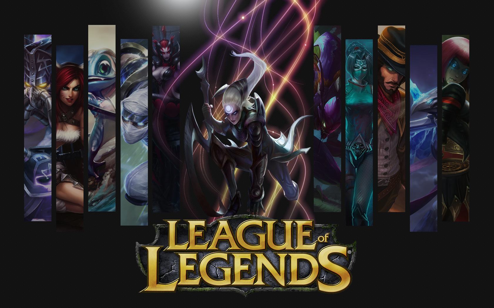
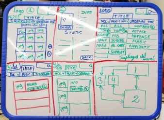
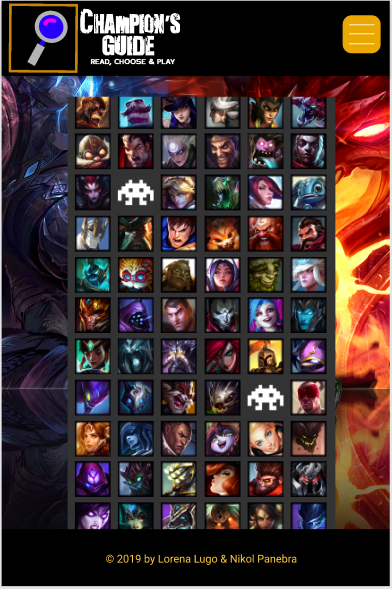
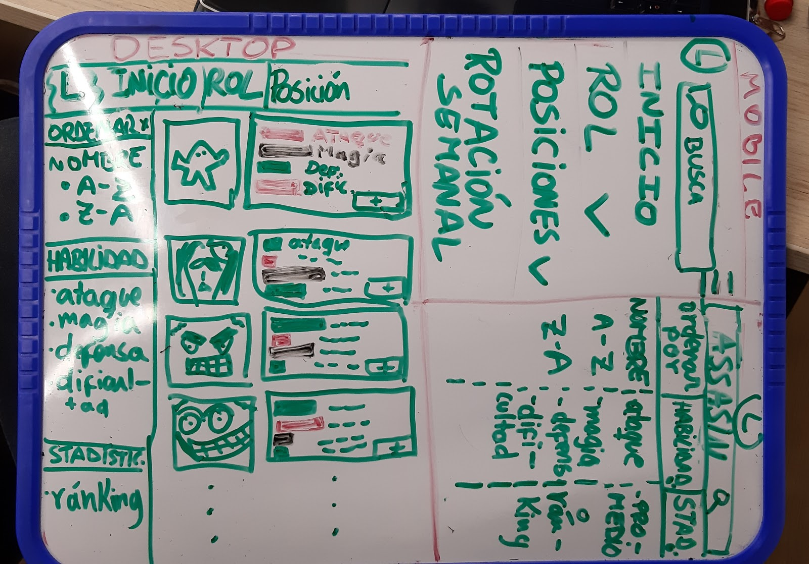

# **Champion's Guide**
## **Preámbulo y contexto general**
League of Legends (LoL) es un mundialmente conocido juego tipo multiplayer online battle arena (MOBA).En términos generales, consiste en formar 2 equipos con 5 campeones cada uno y luchar hasta destruir el núcleo enemigo, por lo que la elección de los mismos es esencial. LoL cuenta con 134 campeones, cada uno con un diseño y estilo de juego único.
## **Elección de la data**
Se escogió la data sobre las características de los campeones porque ambas encontramos interesantes la divesidad de datos. Además, de alguna forma, estábamos familiarizadas con el juego (LOL).## **¿Cómo elegí al usuario?**
De acuerdo a la data obtenida, nos dispusimos a investigar sobre la dinámica del juego, la importancia que reciben estos datos para los jugadores y la manera en que debería ser mostrada. Por lo que preguntamos a jugadores reales sobre sus experiencias y en qué manera les ayudaría tener una app que les muestre las características de los campeones, así como en qué forma le gustaría que esta esté expuesta.## **Proceso de elección del producto**
Luego de la investigación adecuada, se llegó a la conclusión que era popular la idea de ordenar los datos alfabéticamente así como filtrarlos de acuerdo al tipo de rol a la vez que, ya ordenados por rol, ordenarlos en orden descendente por quienes tenían más ataque, defensa, dificultad de manejo y cantidad de maná (poder mágico).El primer prototipo fue este:Prototipo de alta fidelidad de la 1ra pantalla:El 2do prototipo se basó en el feedback de usuario luego del 1er sprint:## **¿Qué problema del usuario soluciona?**
Las características de los personajes (primarias y secundarias) no son mostradas con claridad antes del inicio de una partida, por lo tanto se le complica al usuario saber (o planificar) con antelación qué estrategia de juego usará.## Historias de Usuario
Después de nuestra investigación, identificamos 5 historias de usuario:#### 1) Yo como usuario quiero ver un listado de todos los campeones.#### 2) Yo como usuario quiero ordenar a los campeones según su rol.#### 3) Yo como usuario quiero ver las habilidades (principales y secundarias) de un campeón al seleccionarlo.#### 4) Yo como usuario deseo poder ordenar los campeones de un mismo rol según su ataque, defensa, magia, dificultad. (Por ejemplo, ordenar de mayor a menor ataque a todos los magos).#### 5) Yo como usuario deseo ver el promedio de dificultad de cada rol de los campeones.## **Objetivos de los usuarios en relación al producto**
Los usuarios usarían **Champion's Guide** para obtener información necesaria antes de elegir al campeón ideal al momento de armar su estrategia de juego y, por lo tanto, incrementar las posibilidades de obtener la victoria.## **Elección de opciones de diseño e interacción**
Para mantener la relación visual entre esta app y el mundo de **League of Legends** se ha mantenido las tonalidades y colores característicos de su página web principal.Además, incluimos un link que redirecciona al usuario a la rotación gratuita de campeones de cada semana.## **Tecnologías utilizadas**El proyecto se encuentra desarrollado con JavaScript, CSS y HTML.